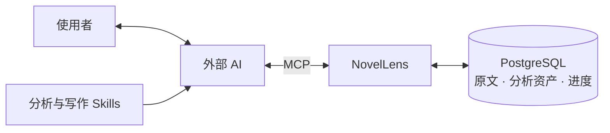

<p align="center">
  
</p>

<p align="center">
  <strong>保存小说原文与轻量标记，让 AI 召回、阅读、理解后创作。</strong>
</p>

<p align="center">
  保真保存原文 · 轻量标记 · 自动索引 · 创作前查读
</p>

<p align="center">
  <a href="pyproject.toml"></a>
  <a href="LICENSE"></a>
  <a href="#连接-ai"></a>
  <a href="#当前状态与路线图"></a>
</p>

<p align="center">
  <a href="#快速开始">快速开始</a> ·
  <a href="#使用示例">使用示例</a> ·
  <a href="#连接-ai">MCP 与 Skills</a> ·
  <a href="docs/部署指南.md">部署文档</a> ·
  <a href="#当前状态与路线图">路线图</a>
</p>

---

## 为什么使用 NovelLens

长篇小说的分析会跨越很多次阅读与会话。关于对白、人物关系或叙述节奏的发现，需要保留对应原文，才能在后续阅读与创作中重新核验和使用。

NovelLens 为外部 AI 提供原文、分析资产、检索和任务进度服务：

- **每条分析都有原文依据。** 保存引用位置与写法说明，之后可以回读证据、补齐上下文或修订判断。
- **长篇阅读可以接续。** 保存已提交的分析成果、覆盖进度和恢复信息，让新的会话继续处理未完成部分。
- **创作参考可以主动查读。** 在选定作品、分部或章节中统一查询原文与标记线索，读取适用正文及上下文，再用于创作；未标记原文同样参与召回。

AI 负责保真整理、阅读、轻量标记和创作，NovelLens 负责原文、可靠进度、自动索引与检索。当前通过 HTTP / MCP 使用；基础原文和资产读写可独立运行，默认准备完成与新查询的语义召回需要 embedding。部署优先使用合适的 GPU，没有合适 GPU 时使用 CPU。功能进展见[当前状态与路线图](#当前状态与路线图)。

## 使用示例

以下是任务流程示意，非实际 AI 宿主运行记录。前提是 NovelLens、数据库和 embedding 已部署，AI 宿主已连接 MCP 并能发现项目的两份 Skill；用户不需要点名工具或安排中间步骤。

| 你交给 AI 的任务 | 工作流程 |
| --- | --- |
| “这份小说 TXT，请准备成后续创作的参考资料。” | 保真整理 → 导入 → 连续阅读与轻量标记；服务自动索引 → 核对完成 |
| “继续准备上次的小说。” | 读取已保存任务和剩余范围 → 补齐上下文 → 连续处理；已成功批次保留 |
| “写一个早餐店明早停水，老板、女儿和邻居商量办法的场景，各有自己的关切。” | 确认新作条件 → 自动查找适用原文 → 阅读理解 → 创作与修订 |

正常流程由 AI 和服务串联，用户无需逐批安排打标或建索引。轻量标记只保存有助于召回的准确范围、标签和必要短说明，不强制实体、关系、风格导航或长篇解读。已有标记可以继续补充或修订，原文不因此改变。

当前应用要求数据库 `0014`。默认导入同时登记准备任务和索引待办，一批标记及进度原子保存；失败只回滚当前操作，之前成功的批次保留。服务自动同步原文与标记线索索引，准备完成同时检查阅读进度与索引状态。AI 停止后不会被服务自动唤醒，后续发起任务时可依据已保存状态继续。

统一检索融合原文与标记线索的语义、字面四路候选，支持多作品及分部/章节范围、稳定候选分页和排除本次已读范围。`library_browse`、`reference_query`、`source_read` 默认返回 `compact`，显式 `full` 提供诊断或详细定位；同一搜索同一页的候选和排序不随格式改变。准备状态、写入结果与历史回执保留操作必要信息。

默认 MCP 为八项业务工具；细粒度维护能力使用独立维护配置。接口见[接口与使用](docs/接口与使用.md)，准备和检索契约见 [Spec 13](specs/13-自动准备与统一原文参考.md)、[Spec 14](specs/14-阅读返回与多作品召回续查.md)。服务与 Skill 须同步更新，旧统一查询参数不再兼容。

## 核心能力

| 能力 | 用途 |
| --- | --- |
| 作品与分部 | 同一主线各部归入一个作品，名称任意、按导入顺序追加；人物与分析贯穿各部 |
| 原文保真与稳定定位 | 保留导入 TXT 的原始字节，以章节、段落和范围定位原文 |
| 写法标注与标签 | 保存证据、说明与适用边界，修订共享标签，撤回／恢复标注；撤回项退出默认检索 |
| 人物与跨章节关系（按需维护） | 关联人物、地点、物件及远距离原文证据，不作为默认准备前置要求 |
| 作品级风格导航（按需维护） | 保存有证据的范围认识和导航入口，不作为准备完成或创作查读的固定步骤 |
| 分析进度与接续 | 记录任务、覆盖范围和恢复信息，接续已提交的工作 |
| 统一原文召回 | 在选定多作品范围查询原文与标记线索，返回可续查、可回读的候选 |

## 工作方式



Skills 提供分析和写作方法，MCP 提供工具调用入口，NovelLens 保存与检索数据。服务也提供 HTTP API，供其他客户端集成。模型与 AI 客户端由使用者自行选择和配置。

## 快速开始

默认在自己的环境运行 Python 应用与 PostgreSQL / PGroonga / pgvector，无需维护者的服务器或账号。

**准备环境：** Git、Python 3.12、uv，以及支持 Linux 容器的 Docker 和 Docker Compose。Windows 可使用 Docker Desktop，或在 WSL 中执行整套流程；不要混用 Windows / WSL 的虚拟环境与命令。

下面用于**全新本机实例**。已有配置或已有数据库请先看[部署指南](docs/部署指南.md#已有数据库)，不要重复初始化。Windows PowerShell 在执行 Python 命令前设置 `$env:PYTHONUTF8 = '1'`。

```shell
git clone https://github.com/Beautiful12138/novel-lens.git
cd novel-lens
uv sync --locked
uv run --locked python scripts/init_local.py
docker compose up -d --build --wait
uv run --locked alembic upgrade head
uv run --locked python -m novel_lens
```

当前迁移末端为 0014。已有 0011/0012/0013 实例可升级至 head；0010 及之前带数据的旧结构不转换，须另建空库后重新导入。升级不会自动清空旧库。

首次构建需要联网下载依赖，可能耗时数分钟。初始化生成独立随机密码和本机配置，遇到已有文件会停止；应用默认监听本机 `127.0.0.1:8000`。

启动后访问[作品列表](http://127.0.0.1:8000/works)，新库应返回空列表，这同时验证应用与数据库读取。通过 [HTTP 接口文档](http://127.0.0.1:8000/docs)操作接口；首次导入步骤见[部署指南](docs/部署指南.md#验证与首次导入)。

Ctrl+C 停止应用，数据库使用 `docker compose stop` 停止。再次使用时执行 `docker compose start --wait`，再启动应用，无需重新初始化。

## 连接 AI

在支持 Streamable HTTP 的 AI 客户端中添加 MCP 地址：

```text
http://127.0.0.1:8000/mcp
```

连接后应枚举到八项业务工具，调用 `library_browse({"view":"works"})` 确认能读取作品列表。维护进程可显式设置 `NOVEL_LENS_MCP_PROFILE=maintenance`，不要将维护连接同时作为日常 AI 的默认工具集。该地址用于 MCP 协议连接；具体配置方式以所用客户端为准。

项目提供两份可独立安装的 Skill：

| Skill | 适用任务 |
| --- | --- |
| [novel-analysis](.agents/skills/novel-analysis/SKILL.md) | 用户提供待分析 TXT 后自动整理、导入、逐批阅读和轻量标记，核对准备完成 |
| [chinese-novel-writing](.agents/skills/chinese-novel-writing/SKILL.md) | 中文小说创作、续写与修订；默认阅读适用文学原文，按题材主动查阅公开背景资料，让资料参与构思与表达 |

按宿主规则安装**完整 Skill 目录**，包含 `SKILL.md` 与 `references/`。用户无需另行要求检索：写作 Skill 默认选择已连接 NovelLens 中的适用参考，并读懂必要原文。用户明确不用参考、仅文字校对或当前上下文已有足够适用原文时按实际需要执行。原文阅读支持 compact 精简格式，工具示例与参数见[接口与使用](docs/接口与使用.md)。

需要 AI 协助部署时，让它阅读[部署指南](docs/部署指南.md#ai-协助部署)。默认准备完成与统一召回必需独立 embedding，基础读写可单独使用。准备 embedding 时使用其中[可直接交给 AI 的任务说明](docs/部署指南.md#ai-协助准备-embedding)：由 AI 检查资源，优先选择可用且性能合适的 GPU，没有合适 GPU 时使用 CPU；真实验证后保存，后续启动复用配置。

## 当前状态与路线图

项目处于持续开发阶段，当前服务仅监听本机回环地址，没有账号鉴权。

| 状态 | 范围 |
| --- | --- |
| 已实现 | 原文导入与读取、分析资产、关系与风格导航、任务进度、关键词检索、HTTP / MCP、两份 Skill |
| 已实现 | 自动准备与索引、原文和线索四路融合召回、八项默认 MCP，见 Spec 13 |
| 已实现 | compact/full 阅读返回、多作品及分部/章节范围、稳定续查与已读排除，见 Spec 14 |
| 已验证 | 限定 CPU / RTX 4070 CUDA 环境的真实模型与协议流程，证据及限制见 Spec 10、13、14 |
| 待实现 | Web UI |
| 已验证 | 当前执行的 AI 在真实小说 80 段节选上连续准备、召回、回读并创作；范围与限制见 Spec 13 |
| 待验证 | 长篇规模成本、独立文学对照与用户读感、其他宿主环境与其他 GPU 的兼容性 |

作品屏蔽、恢复显示和整部物理删除提供 HTTP 管理接口，见[接口说明](docs/接口与使用.md#作品屏蔽与物理删除)及 [Spec 11](specs/11-作品屏蔽与物理删除.md)；WebUI 后续接入。

当前规格与验收记录见 [specs/](specs/)。语义检索的范围见 [Spec 10](specs/10-原文语义检索与Embedding部署.md)，部署实测边界见[验证范围](docs/部署指南.md#验证范围)。

## 文档与参与

| 我想了解 | 入口 |
| --- | --- |
| 安装、已有数据库、升级与备份 | [部署指南](docs/部署指南.md) |
| TXT 格式、HTTP / MCP 与工具调用 | [接口与使用](docs/接口与使用.md) |
| 记录本机配置与服务入口 | [可选环境记录模板](docs/本地环境.example.md) |
| embedding 模型、实测结果与运行参数 | [Embedding 选型与 CPU 验证](docs/Embedding选型与CPU验证.md) |
| 已确认目标与职责边界 | [需求与设计基线](docs/小说分析与创作知识服务_需求与设计基线.md) |
| 功能契约、验收条件与验证记录 | [功能规格](specs/)；主流程见 Spec 13、14 |
| 参与开发和运行测试 | [开发约定](AGENTS.md) · [开发验证](docs/部署指南.md#开发验证) |

README 概述当前产品与使用入口，需求基线维护有效目标，Spec 定义具体行为及验收；接口和部署文档提供操作方法。带日期的旧版本、硬件和测试结果属于历史记录，不表示当前环境状态。

数据保存在使用者自己的数据库；本机配置、小说素材与模型权重不进入 Git。换电脑时需连接原库或迁移备份，克隆代码不会自动复制数据。具体位置与操作见[配置与数据位置](docs/部署指南.md#配置与数据位置)。

欢迎通过 [Issues](https://github.com/Beautiful12138/novel-lens/issues)反馈问题或讨论功能，报告问题时请附复现步骤与运行环境，避免附上凭据和完整小说。提交改动前阅读开发约定；涉及新功能时先讨论范围与 Spec。

## 许可证

NovelLens 采用 [MIT 许可证](LICENSE)，允许个人和企业免费使用、修改、分发及商业使用，无需另行申请授权，也不要求修改版公开源码。分发软件或其重要部分时，须保留版权声明和许可证；软件按现状提供，不作担保。

第三方依赖、模型权重和导入的小说素材遵循各自的许可或权利声明，不因使用 NovelLens 而自动适用本项目的 MIT 许可证。
