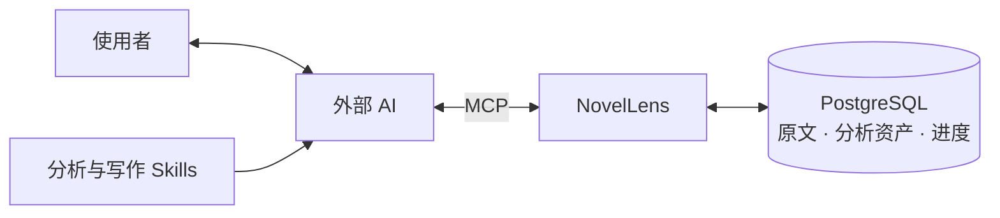

<p align="center">
  
</p>

<p align="center">
  <strong>把小说原文与写法分析，整理成 AI 可查询的创作参考库。</strong>
</p>

<p align="center">
  保存原文证据 · 积累写法分析 · 接续阅读任务 · 按需查找创作参考
</p>

<p align="center">
  <a href="pyproject.toml"></a>
  <a href="LICENSE"></a>
  <a href="#连接-ai"></a>
  <a href="#当前状态与路线图"></a>
</p>

<p align="center">
  <a href="#快速开始">快速开始</a> ·
  <a href="#使用示例">使用示例</a> ·
  <a href="#连接-ai">MCP 与 Skills</a> ·
  <a href="docs/部署指南.md">部署文档</a> ·
  <a href="#当前状态与路线图">路线图</a>
</p>

---

## 为什么使用 NovelLens

长篇小说的分析会跨越很多次阅读与会话。关于对白、人物关系或叙述节奏的发现，需要保留对应原文，才能在后续阅读与创作中重新核验和使用。

NovelLens 为外部 AI 提供原文、分析资产、检索和任务进度服务：

- **每条分析都有原文依据。** 保存引用位置与写法说明，之后可以回读证据、补齐上下文或修订判断。
- **长篇阅读可以接续。** 保存已提交的分析成果、覆盖进度和恢复信息，让新的会话继续处理未完成部分。
- **创作参考可以按需查找。** 在指定作品中搜索原文及写法说明，结合标签、人物关系和风格导航找到值得阅读的片段。

AI 负责阅读、文学判断与创作，NovelLens 负责稳定地保存和提供数据。当前以 HTTP / MCP 服务使用，基础功能无需 GPU 或下载模型；功能进展见[当前状态与路线图](#当前状态与路线图)。

## 使用示例

以下是任务流程示意，非实际 AI 宿主运行记录。前提是已导入结构确认的 TXT，连接 NovelLens MCP，并加载所需 Skill；将“参考作品名”替换为实际作品。

| 你交给 AI 的任务 | 工作流程 |
| --- | --- |
| “通过 NovelLens 阅读《参考作品名》第一章，分析人物对话如何表现关系，保存有证据的标注和进度。” | 读取原文 → 分析写法与适用条件 → 保存引用和说明 → 提交进度 |
| “从 NovelLens 恢复《参考作品名》上次保存的分析任务，继续未完成的部分。” | 读取任务、覆盖进度与恢复信息 → 补齐上下文 → 接续分析 |
| “在 NovelLens 的《参考作品名》写法说明中搜索‘对话’，回读相关原文，为新场景寻找参考。” | 关键词检索 → 比较标注 → 回读证据 → 结合新作约束创作 |

分析资产保留的是可核验的发现与引用。支持关键词搜索，以及通过本机 embedding 查询全文原文或标注引用原文的自然语言语义检索。

## 核心能力

| 能力 | 用途 |
| --- | --- |
| 原文保真与稳定定位 | 保留导入 TXT 的原始字节，以章节、段落和范围定位原文 |
| 写法标注与标签 | 保存证据、简短说明与适用边界，按标签组织分析成果 |
| 人物与跨章节关系 | 关联人物、地点、物件及远距离原文证据 |
| 作品级风格导航 | 保存作品层面的认识与代表性证据入口，帮助恢复理解 |
| 分析进度与接续 | 记录任务、覆盖范围和恢复信息，接续已提交的工作 |
| 原文与说明检索 | 在指定作品中搜索原文和标注说明，返回可回读的候选 |

## 工作方式



Skills 提供分析和写作方法，MCP 提供工具调用入口，NovelLens 保存与检索数据。服务也提供 HTTP API，供其他客户端集成。模型与 AI 客户端由使用者自行选择和配置。

## 快速开始

默认在自己的环境运行 Python 应用与 PostgreSQL / PGroonga / pgvector，无需维护者的服务器或账号。

**准备环境：** Git、Python 3.12、uv，以及支持 Linux 容器的 Docker 和 Docker Compose。Windows 可使用 Docker Desktop，或在 WSL 中执行整套流程；不要混用 Windows / WSL 的虚拟环境与命令。

下面用于**全新本机实例**。已有配置或已有数据库请先看[部署指南](docs/部署指南.md#已有数据库)，不要重复初始化。Windows PowerShell 在执行 Python 命令前设置 `$env:PYTHONUTF8 = '1'`。

```shell
git clone https://github.com/Beautiful12138/novel-lens.git
cd novel-lens
uv sync --locked
uv run --locked python scripts/init_local.py
docker compose up -d --build --wait
uv run --locked alembic upgrade head
uv run --locked python -m novel_lens
```

首次构建需要联网下载依赖，可能耗时数分钟。初始化生成独立随机密码和本机配置，遇到已有文件会停止；应用默认监听本机 `127.0.0.1:8000`。

启动后访问[作品列表](http://127.0.0.1:8000/works)，新库应返回空列表，这同时验证应用与数据库读取。通过 [HTTP 接口文档](http://127.0.0.1:8000/docs)操作接口；首次导入步骤见[部署指南](docs/部署指南.md#验证与首次导入)。

Ctrl+C 停止应用，数据库使用 `docker compose stop` 停止。再次使用时执行 `docker compose start --wait`，再启动应用，无需重新初始化。

## 连接 AI

在支持 Streamable HTTP 的 AI 客户端中添加 MCP 地址：

```text
http://127.0.0.1:8000/mcp
```

连接后枚举工具并调用 `work_list`，确认能读取作品列表。该地址用于 MCP 协议连接；具体配置方式以所用客户端为准。

项目提供两份可独立安装的 Skill：

| Skill | 适用任务 |
| --- | --- |
| [novel-analysis](.agents/skills/novel-analysis/SKILL.md) | 小说深读、写法标注、分析资产保存与任务接续 |
| [chinese-novel-writing](.agents/skills/chinese-novel-writing/SKILL.md) | 中文小说构思、正文创作、续写与修订；按需查询参考库 |

按宿主规则安装**完整 Skill 目录**，包含 `SKILL.md` 与 `references/`。普通中文写作无需强制连接 NovelLens；使用参考库时再调用 MCP。工具示例与参数见[接口与使用](docs/接口与使用.md)。

需要 AI 协助部署时，让它阅读[部署指南](docs/部署指南.md#ai-协助部署)。准备可选的独立 embedding 时，使用其中[可直接交给 AI 的任务说明](docs/部署指南.md#ai-协助准备-embedding)：由 AI 检查本机资源、选择参数，真实验证后保存，后续启动复用配置。

## 当前状态与路线图

项目处于持续开发阶段，当前服务仅监听本机回环地址，没有账号鉴权。

| 状态 | 范围 |
| --- | --- |
| 已实现 | 原文导入与读取、分析资产、关系与风格导航、任务进度、关键词检索、HTTP / MCP、两份 Skill |
| 已实现 | embedding 独立运行、全文与标注原文向量索引、可接续分批构建、动态覆盖与语义检索；CPU 已实测 |
| 待实现 | Web UI |
| 待验证 | 实际 AI 宿主的完整工作流程、文学效果，以及 GPU 与跨设备向量一致性 |

当前规格与验收记录见 [specs/](specs/)。语义检索的范围见 [Spec 10](specs/10-原文语义检索与Embedding部署.md)，部署实测边界见[验证范围](docs/部署指南.md#验证范围)。

## 文档与参与

| 我想了解 | 入口 |
| --- | --- |
| 安装、已有数据库、升级与备份 | [部署指南](docs/部署指南.md) |
| TXT 格式、HTTP / MCP 与工具调用 | [接口与使用](docs/接口与使用.md) |
| 记录本机配置与服务入口 | [可选环境记录模板](docs/本地环境.example.md) |
| embedding 模型、实测结果与运行参数 | [Embedding 选型与 CPU 验证](docs/Embedding选型与CPU验证.md) |
| 项目设计与功能规格 | [需求与设计基线](docs/小说分析与创作知识服务_需求与设计基线.md) · [功能规格](specs/) |
| 参与开发和运行测试 | [开发约定](AGENTS.md) · [开发验证](docs/部署指南.md#开发验证) |

数据保存在使用者自己的数据库；本机配置、小说素材与模型权重不进入 Git。换电脑时需连接原库或迁移备份，克隆代码不会自动复制数据。具体位置与操作见[配置与数据位置](docs/部署指南.md#配置与数据位置)。

欢迎通过 [Issues](https://github.com/Beautiful12138/novel-lens/issues)反馈问题或讨论功能，报告问题时请附复现步骤与运行环境，避免附上凭据和完整小说。提交改动前阅读开发约定；涉及新功能时先讨论范围与 Spec。

## 许可证

NovelLens 采用 [MIT 许可证](LICENSE)，允许个人和企业免费使用、修改、分发及商业使用，无需另行申请授权，也不要求修改版公开源码。分发软件或其重要部分时，须保留版权声明和许可证；软件按现状提供，不作担保。

第三方依赖、模型权重和导入的小说素材遵循各自的许可或权利声明，不因使用 NovelLens 而自动适用本项目的 MIT 许可证。
