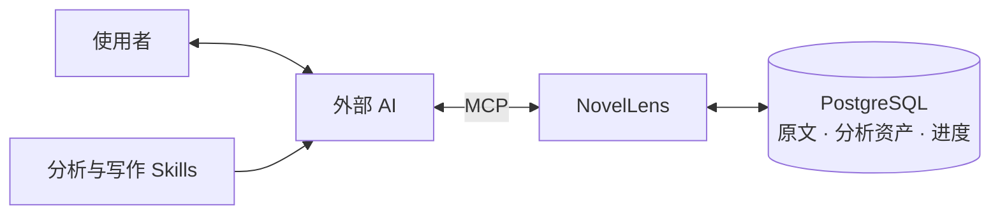

<p align="center">
  
</p>

<p align="center">
  <strong>保存原文与写法观察，让 AI 理解作品怎样写，并用于新的创作。</strong>
</p>

<p align="center">
  保真保存原文 · 具体观察与作品认识 · 分类标签导航 · 创作前查读
</p>

<p align="center">
  <a href="pyproject.toml"></a>
  <a href="LICENSE"></a>
  <a href="#连接-ai"></a>
  <a href="#当前状态与路线图"></a>
</p>

<p align="center">
  <a href="#快速开始">快速开始</a> ·
  <a href="#使用示例">使用示例</a> ·
  <a href="#连接-ai">MCP 与 Skills</a> ·
  <a href="docs/部署指南.md">部署文档</a> ·
  <a href="#当前状态与路线图">路线图</a>
</p>

---

## 为什么使用 NovelLens

长篇小说的分析会跨越很多次阅读与会话。关于对白、人物关系或叙述节奏的发现，需要保留对应原文，才能在后续阅读与创作中重新核验和使用。

NovelLens 为外部 AI 提供原文、分析资产、检索和任务进度服务：

- **每条分析都有原文依据。** 分别保存证据位置、连续阅读范围与各处用途，之后可以回读、补齐上下文或修订判断。
- **长篇阅读可以接续。** 保存已提交的分析成果、覆盖进度和恢复信息，让新的会话继续处理未完成部分。
- **创作参考可以主动查读。** 整体参考先查作品认识或目录，连续阅读后形成新作自身的选择，再构思与写作；局部问题也可按分类与标签寻找原文。

AI 负责保真整理、阅读、写法观察与比较和创作，NovelLens 负责原文、分析资产、分类浏览与可靠进度。当前通过 HTTP / MCP 和 PC WebUI 使用。服务不运行模型；分类浏览与关键词检索都直接使用数据库中的当前内容。功能进展见[当前状态与路线图](#当前状态与路线图)。

## WebUI

正式页面由业务服务提供 `http://127.0.0.1:8000/ui/`，支持作品目录、正文分页、完整标注与多处引用跳转。标签库提供全库／单作品／多作品范围、六个固定分类、全部和未分类、标签多选以及任一／全部匹配；作品整体与跨片段比较另设入口。标注库支持具体观察／作品认识筛选、标题与说明字面查询和撤回状态筛选；详情区分证据与连续阅读范围。进入原文后可返回原浏览位置。当前以阅读浏览为主，写操作后续实现。

首次启动前，在 `web/` 使用 Node.js 22.12+构建：

```sh
cd web
npm ci
npm run build
cd ..
```

随后按下文启动业务服务即可，无需单独启动前端服务。开发时可以在 `web/` 执行 `npm run dev`；测试为 `npm test`。生产产物进入 Python 包内，发布 wheel 前也必须先构建。早期静态原型保留在 `docs/prototypes/`，与正式 `/ui/` 独立。

## 使用示例

以下是任务流程示意，非实际 AI 宿主运行记录。前提是 NovelLens 和数据库已部署，AI 宿主已连接 MCP 并能发现项目的两份 Skill；用户不需要点名工具或安排中间步骤。

| 你交给 AI 的任务 | 工作流程 |
| --- | --- |
| “这份小说 TXT，请准备成后续创作的参考资料。” | 保真整理 → 导入 → 连续阅读、具体写法观察与比较 → 核对完成 |
| “继续准备上次的小说。” | 读取已保存任务和剩余范围 → 补齐上下文 → 连续处理；已成功批次保留 |
| “写一个早餐店明早停水，老板、女儿和邻居商量办法的场景，各有自己的关切。” | 确认新作条件 → 自动查找适用原文 → 阅读理解 → 创作与修订 |

正常流程由 AI 和服务串联，用户无需逐批安排打标。分析结合必要上下文，理解内容怎样选择与展开、句行如何相接，以及声音怎样随情境变化。原文保留依据，标注保存可核对的阅读成果和证据联系，标签帮助查找；有依据的跨片段认识通过 `kind=comparison` 明确查找，再回读原文，在新作条件下重新创造。方法随分析 Skill 提供，少量短例按需选读；不要求逐句建卡、固定技巧配额、完整人物百科或长篇报告。已有观察可以补充或修订，原文不因此改变，详见 [Spec 08](specs/08-分析与创作Skill.md)。

当前应用要求数据库 `0017`。导入与准备任务原子登记，一批标注、标签及进度原子保存；失败只回滚当前操作，之前成功的批次保留。完成准备检查阅读覆盖。AI 停止后不会被服务自动唤醒，后续会话可依据已保存状态继续。

整体参考路径是作品认识或目录 → 连续原文 → 本作选择 → 构思与写作；局部问题可走分类 → 标签 → 标注 → 原文。标签可跨多个分类，分类不由 AI 创建；标签仍全库共享。省略作品范围可查共享词表，指定范围只显示其中有效标注使用的标签。标注按任一标签命中，也可切换为全部命中。`library_browse` 和 `source_read` 默认 `compact`，显式 `full` 提供详细字段；详情保留所有原文依据和各处用途，并提供可直接读取的完整 read_target。

默认 MCP 为15 项业务工具，包含 `tag_update`，不再提供 `reference_query`；原统一召回和自动索引任务已移除。分类、范围及标注浏览契约见 [Spec 17](specs/17-分类标签与原文浏览.md)，接口见[接口与使用](docs/接口与使用.md)。服务与两个 Skill 须同步更新。0017 移除剩余语义接口、旧向量及检索派生表，保留原文、当前标注和分析进度；升级前须备份并验证恢复，见[部署指南](docs/部署指南.md#已有数据库)。

## 核心能力

| 能力 | 用途 |
| --- | --- |
| 作品与分部 | 同一主线各部归入一个作品，名称任意、按导入顺序追加；人物与分析贯穿各部 |
| 原文保真与稳定定位 | 保留导入 TXT 的原始字节，以章节、段落和范围定位原文 |
| 写法标注与标签 | 保存证据、说明与适用边界，修订共享标签，撤回／恢复标注；撤回项退出默认检索 |
| 人物与跨章节关系（按需维护） | 关联人物、地点、物件及远距离原文证据，不作为默认准备前置要求 |
| 作品认识 | 阅读中持续比较内容选择、语言接续与条件变化；独立发现、逐处连续回读，与具体观察共用版本和纠错 |
| 分析进度与接续 | 记录任务、覆盖范围和恢复信息，接续已提交的工作 |
| 分类与原文浏览 | 按全库或指定作品发现标签，通过标注的每处引用回读原文 |

## 工作方式


```mermaid
flowchart LR
    U[使用者] <--> A[外部 AI]
    S[分析与写作 Skills] --> A
    A <-->|MCP| N[NovelLens]
    N <--> D[(PostgreSQL<br/>原文 · 分析资产 · 进度)]
```

Skills 提供分析和写作方法，MCP 提供工具调用入口，NovelLens 保存与检索数据。服务也提供 HTTP API，供其他客户端集成。外部 AI 模型与客户端由使用者自行选择和配置。

## 快速开始

在自己的环境运行 NovelLens 和 PostgreSQL / PGroonga 即可，无需部署 embedding、下载模型或准备 GPU。

**准备环境：** Git、Python 3.12、uv、Node.js 22.12+，以及支持 Linux 容器的 Docker 和 Docker Compose。Windows 可使用 Docker Desktop，或在 WSL 中执行整套流程；不要混用 Windows / WSL 的虚拟环境与命令。

下面用于**全新本机实例**。已有配置或已有数据库请先看[部署指南](docs/部署指南.md#已有数据库)，不要重复初始化。Windows PowerShell 在执行 Python 命令前设置 `$env:PYTHONUTF8 = '1'`。

```shell
git clone https://github.com/Beautiful12138/novel-lens.git
cd novel-lens
uv sync --locked
uv run --locked python scripts/init_local.py
docker compose up -d --build --wait
uv run --locked python scripts/init_database.py
npm --prefix web ci
npm --prefix web run build
uv run --locked python -m novel_lens
```

新库由 `init_database.py` 原子建立当前结构并登记 `0017`，非空库拒绝初始化。已有 0016 库使用 Alembic 升级；0011–0015 还会经过清理旧分析的 0016 迁移，须核对不同的清理范围。0010 及之前带数据的旧结构不转换。详见[已有数据库](docs/部署指南.md#已有数据库)。

首次构建需要联网下载依赖，可能耗时数分钟。初始化生成独立随机密码和本机配置，遇到已有文件会停止；应用默认监听本机 `127.0.0.1:8000`。

启动后访问[作品列表](http://127.0.0.1:8000/works)，新库应返回空列表，这同时验证应用与数据库读取。通过 [HTTP 接口文档](http://127.0.0.1:8000/docs)操作接口；首次导入步骤见[部署指南](docs/部署指南.md#验证与首次导入)。

Ctrl+C 停止应用，数据库使用 `docker compose stop` 停止。再次使用时执行 `docker compose start --wait`，再启动应用，无需重新初始化。

## 连接 AI

在支持 Streamable HTTP 的 AI 客户端中添加 MCP 地址：

```text
http://127.0.0.1:8000/mcp
```

连接后应枚举到15 项业务工具，调用 `library_browse({"view":"works"})` 确认能读取作品列表。维护进程可显式设置 `NOVEL_LENS_MCP_PROFILE=maintenance`，不要将维护连接同时作为日常 AI 的默认工具集。该地址用于 MCP 协议连接；具体配置方式以所用客户端为准。

仅能发送普通 HTTP 请求的 AI，可读取 `GET /ai/openapi.json` 发现与 15 项 MCP 工具对应的操作；完整请求示例、局部修订、分页和错误恢复见 [AI HTTP 使用指南](docs/AI-HTTP使用指南.md)。两份 Skill 均附带该指南，不需要另装 HTTP 版 Skill。

项目提供两份可独立安装的 Skill：

| Skill | 适用任务 |
| --- | --- |
| [novel-analysis](.agents/skills/novel-analysis/SKILL.md) | 用户提供待分析 TXT 后自动整理、导入，逐批辨认具体写法并保存比较认识，核对准备完成 |
| [chinese-novel-writing](.agents/skills/chinese-novel-writing/SKILL.md) | 中文小说创作、续写与修订；默认阅读适用文学原文，按题材主动查阅公开背景资料，让资料参与构思与表达 |

按宿主规则安装**完整 Skill 目录**，包含 `SKILL.md` 与 `references/`。用户无需另行要求检索：写作 Skill 默认选择已连接 NovelLens 中的适用参考，并读懂必要原文。用户明确不用参考、仅文字校对或当前上下文已有足够适用原文时按实际需要执行。原文阅读支持 compact 精简格式，工具示例与参数见[接口与使用](docs/接口与使用.md)。

需要 AI 协助部署时，让它阅读[部署指南](docs/部署指南.md#ai-协助部署)，核对当前环境、数据库版本与配置后安装、构建并验证业务接口。

## 当前状态与路线图

项目处于持续开发阶段，应用仅监听本机回环地址；通过 HTTPS 反向代理部署时支持单密钥鉴权，HTTP/MCP 使用 Bearer，网页使用有期限的登录会话。服务器配置与边界见 [部署指南](docs/部署指南.md#服务器部署与单密钥鉴权)。

| 状态 | 范围 |
| --- | --- |
| 已实现 | 原文导入与读取、分析资产、关系、任务进度、关键词检索、HTTP / MCP、两份 Skill |
| 已实现 | 原子准备、固定分类、多作品标签与标注浏览、分类浏览与默认 MCP，见 Spec 17 |
| 已实现 | compact/full 阅读返回、稳定原文定位与分页、PC WebUI 阅读和分类浏览 |
| 已实现 | 作品认识、证据与连续阅读范围、相关 Skill 和 WebUI；工程验证及共享开发库升级结果见 [Spec 18](specs/18-连续阅读与叙述选择.md) |
| 待实现 | WebUI 写入与管理操作 |
| 已实现 | 段号寻址、局部修订与预检、标注历史/导出、已读暂存及 15 项 HTTP/MCP 对等能力；见 [Spec 20](specs/20-AI分析操作与HTTP对等接口.md) |
| 历史验证 | 当时执行的 AI 在真实小说 80 段节选上连续准备、召回、回读并创作；范围与限制见 Spec 13 |
| 待验证 | 长篇阅读与分析成本、用户实际读感及其他 AI 宿主的使用效果 |

作品屏蔽、恢复显示和整部物理删除提供 HTTP 管理接口，见[接口说明](docs/接口与使用.md#作品屏蔽与物理删除)及 [Spec 11](specs/11-作品屏蔽与物理删除.md)；WebUI 后续接入。

当前规格与验收记录见 [specs/](specs/)。语义能力退役与数据库清理边界见 [Spec 19](specs/19-移除语义检索与模型运行依赖.md)，部署实测边界见[验证范围](docs/部署指南.md#验证范围)。

## 文档与参与

| 我想了解 | 入口 |
| --- | --- |
| 安装、已有数据库、升级与备份 | [部署指南](docs/部署指南.md) |
| TXT 格式、HTTP / MCP 与工具调用 | [接口与使用](docs/接口与使用.md) |
| 记录本机配置与服务入口 | [可选环境记录模板](docs/本地环境.example.md) |
| 已确认目标与职责边界 | [需求与设计基线](docs/小说分析与创作知识服务_需求与设计基线.md) |
| 功能契约、验收条件与验证记录 | [功能规格](specs/)；主流程见 Spec 17、18、20 |
| 参与开发和运行测试 | [开发约定](AGENTS.md) · [开发验证](docs/部署指南.md#开发验证) |

README 概述当前产品与使用入口，需求基线维护有效目标，Spec 定义具体行为及验收；接口和部署文档提供操作方法。带日期的旧版本、硬件和测试结果属于历史记录，不表示当前环境状态。

数据保存在使用者自己的数据库；本机配置、小说素材、数据库及备份不进入 Git。换电脑时需连接原库或迁移备份，克隆代码不会自动复制数据。具体位置与操作见[配置与数据位置](docs/部署指南.md#配置与数据位置)。

欢迎通过 [Issues](https://github.com/Beautiful12138/novel-lens/issues)反馈问题或讨论功能，报告问题时请附复现步骤与运行环境，避免附上凭据和完整小说。提交改动前阅读开发约定；涉及新功能时先讨论范围与 Spec。

## 许可证

NovelLens 采用 [MIT 许可证](LICENSE)，允许个人和企业免费使用、修改、分发及商业使用，无需另行申请授权，也不要求修改版公开源码。分发软件或其重要部分时，须保留版权声明和许可证；软件按现状提供，不作担保。

第三方依赖和导入的小说素材遵循各自的许可或权利声明，不因使用 NovelLens 而自动适用本项目的 MIT 许可证。
